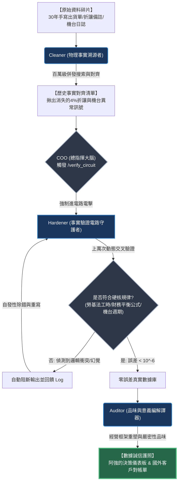

# Sapper-Shield V2 原生服務方案：精密五金廠「數據誠信護照」導入規劃書

> [!NOTE]
> **本案專屬對象**：精密五金加工廠接班人 —— 阿強（品管與數位轉型負責人）
> **專案主旨**：透過 AI 原生驗證電路與物理溯源系統，消滅產線與財務數據幻覺，建立無可挑戰的「外部事實錨點」，協助接班人以「數據真實性」樹立管理威信，鎖死跨國大客戶訂單。

---

## 1. 核心洞見與經營框架重塑 (Auditor Reframing)

傳統諮詢公司或套裝 ERP 系統，常將阿強的困境歸咎於「員工配合度低」或「系統代碼混亂」。然而，Sapper-Shield 透過事實熔煉，為阿強重塑核心問題的認知框架：

| 項目 | 傳統舊框架 (V1 替代型思維) | Sapper-Shield 原生新框架 (V2 事實鑄幣廠) |
| :--- | :--- | :--- |
| **問題認知** | AI 工具太爛、代碼混亂，導致排班與財務對帳頻繁當機。 | **「三十年手寫單據非結構工作流」** 與 **「現代 AI 語意理解」** 之間存在嚴重的信賴斷層。 |
| **數據漏洞** | 老師傅手寫塗改的單據、庫存與 Excel 記帳存在人為疏失。 | 傳統排班與庫存邏輯，**未將機台硬體老化率及環境濕度等物理常數計算在內**。 |
| **解決方案** | 聘請傳統顧問或 IT 手動去冗代碼、重寫報表、美化文字。 | 建立 **「外部邏輯驗證電路」**，任何數據未過電路篩選前，一律不得進入決策端。 |
| **最終效益** | 暫時恢復系統運作，但 AI 幻覺與帳目造假疑慮依然存在。 | 打造 **「數據誠信護照」**，以絕對事實鎖死客戶信任，掌握全局主導權。 |

---

## 2. 數據誠信護照系統架構 (System Architecture)

以下為本方案的系統運作電路圖。本系統以 **COO (總指揮)** 為大腦，調度 **Cleaner (物理事實溯源者)** 與 **Hardener (事實驗證電路守護者)**，最後由 **Auditor (品味與意義編譯器)** 交付給阿強：

---

## 3. 服務三大支柱與工兵角色調度 (Three Pillars & Specialist Roles)

### 支柱一：Cleaner 數據事實溯源 —— 挖掘「消失的 4% 帳目」與「排班代碼亂碼」
*   **工兵指派**：`Cleaner`（物理事實溯源者）
*   **輸入來源**：阿強廠內過去三十年的手寫單據掃描檔、舊 Excel 庫存紀錄、以及產線機台底層的原始日誌（log）。
*   **執行機制**：
    1. 針對月底帳目不對齊問題：Cleaner 啟動百萬級併發搜索，交叉比對「歷史對帳單」與「手寫原始折讓單」，精準定位出由於第三方 AI 忽略「手寫折讓備註」所產生的每月約 **4% 金額落差真相**。
    2. 針對排班當機問題：Cleaner 調閱機台維修日誌，定位出「無效排班代碼」的物理根源（例如：三號機台在特定濕度下自動停機報錯，導致第三方 AI 誤判為亂碼）。
*   **交付成果**：一份**「歷史事實對齊清單」**，將混亂碎片強制與現實世界的物理記錄對齊。

### 支柱二：Hardener 邏輯電路驗證 —— 秒級萬次「電擊測試」與自發性除錯
*   **工兵指派**：`Hardener`（事實驗證電路守護者）
*   **執行機制（COO 強制觸發 `/verify_circuit`）**：
    1. 將 Cleaner 清理後的數據與預測模型，丟入專屬的外部強化學習（RL）測試環境。
    2. **四方交叉驗證**：自動將現有訂單、出貨單、折讓單與銀行流水進行四方對齊，自動偵測並剔除因 AI 幻覺產生的虛假庫存數據。
    3. **排班動態防線**：將新產生的排班表放入虛擬工廠環境中，比對「勞基法工時上限」、「機台維修週期」及「老師傅請假經驗」，未過關的代碼一律自動攔截、退回並觸發自發性除錯重寫。
*   **交付成果**：所有營運數據與排班邏輯，**邏輯誤差降至 $10^{-6}$ 以下** 的零出錯真實數據庫。

### 支柱三：Auditor 真理編譯與意義重塑 —— 建立接班人數據威信
*   **工兵指派**：`Auditor`（品味與意義編譯器）
*   **執行機制**：
    1. 將通過 Hardener 測試的零誤差數據，與人類對「嚴密性」的執著品味相結合。
    2. **推翻舊有認知**：重塑阿強的決策框架。不再是「科技工具好不好用」，而是「如何用不容挑戰的數據誠信，讓廠內老臣啞口無言，讓跨國客戶徹底信服」。
*   **交付成果**：具備誠信標章的 **「數據誠信護照」決策儀表板** 與 **「高密度真理知識庫」**。

---

## 4. 客戶帶走的具體交付物與長期效益

> [!IMPORTANT]
> 本專案絕不交付「文字美化後的垃圾報告」。阿強在本次服務結束後，將帶走以下能夠長期運行的「數位防線」：

1.  **☑ 一份或幾份文件**：
    *   **《數據誠信護照（Data Integrity Passport）》**：可直接提交給外銷跨國大客戶的品質與財務誠信憑證。
    *   **《機台物理日誌與手寫工作流對齊指南》**：讓現場老臣與新系統無縫接軌的物理 SOP。
2.  **☑ 一個可運行的系統**：
    *   **「事實驗證電路環境」**：長駐於工廠系統後端的自動稽核模組。未來不論任何 AI 助理產生何種報表，未通過此電路驗證，皆無法輸出。
3.  **☑ 一個會繼續服務他的 Agent**：
    *   **長駐產線後端的 AI 稽核員**：24小時併發監控數據，隨時做阿強做決策時「強而有力的數位後盾」。
4.  **☑ 一種他原本沒有的能力或視角**：
    *   **「事實冶煉思維」**：阿強將徹底學會不再跟隨混亂的表象起舞，而是以「物理 facts 對齊與邏輯電路測試」的視角，牢牢掌控整間工廠的營運命脈。

---

## 5. 服務邊界與守則 (Service Boundaries)

為了確保事實鑄幣廠的最高誠信度，我們向阿強聲明以下明確邊界：

*   **我們絕對會做的事**：
    *   挖出隱藏在舊紙堆與系統日誌中的數據真相，無論真相多麼難堪（例如老臣隨手塗改的真實折讓、機台真實的老化停機率）。
    *   強制實施零誤差的 `/verify_circuit`，保證對外報表絕對不被客戶打臉。
*   **我們絕對不做的事**：
    *   ❌ **絕不協助美化財報或數據造假**。我們的核心價值是「真實性」，任何企圖欺騙大客戶或財務稽核的虛假需求將會被系統強制斷開。
    *   ❌ **絕不介入阿強與老臣之間的人事糾紛與管理權鬥**。我們提供的是「無可挑戰的事實利器」，讓數據自己說話，而非代為進行辦公室政治的調解。

---
Sapper-Shield V2 拒絕平庸，我們不幫客戶塗脂抹粉，我們只用超人類算力，為您熔煉出不容置疑的真理金塊。
